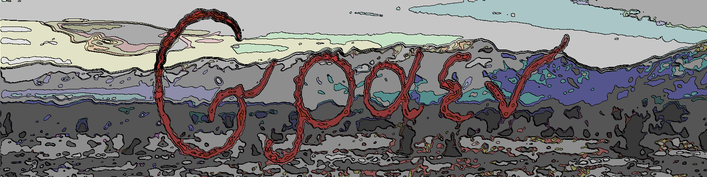

# Learning
Here I store the projects I've done on my way.

## Structure

#### Common Python

Contains my Python learning path. From trivial tasks to the most composite work - **pyth_06**. Here 
a microservice architecture was implemented with gRPC.

#### CPP

I know C++ and C too 😄

#### LeetCode

Contains solutions to algorithmic excercises from LeetCode

#### DataScience

My attempt to data science (which is not my thing)

#### Useful

Contains templates of data structures, solutions and algorithms, that I cherish.

#### Monitoring

Contains complex bash scripts for generating files in random locations and delete them by log, mask or creation time.
Then there are monitoring stuff like grafana and prometheus. And at the end there is my exporter, written in C, which is served
by NGINX (to provide html to Promtheus) and which collects CPU and space data.

